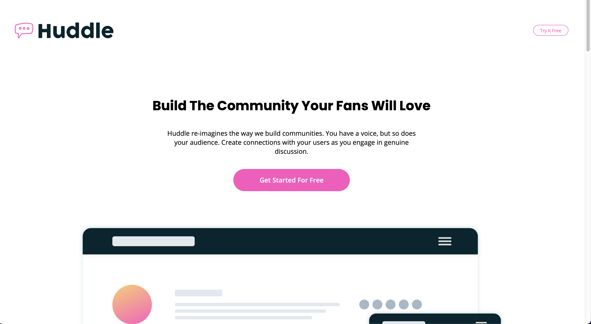

# Frontend Mentor - Huddle landing page with curved sections solution

This is a solution to the [Huddle landing page with curved sections challenge on Frontend Mentor](https://www.frontendmentor.io/challenges/huddle-landing-page-with-curved-sections-5ca5ecd01e82137ec91a50f2). Frontend Mentor challenges help you improve your coding skills by building realistic projects.

## Table of contents

- [Overview](#overview)
  - [The challenge](#the-challenge)
  - [Screenshot](#screenshot)
  - [Links](#links)
- [My process](#my-process)
  - [Built with](#built-with)
  - [Continued development](#continued-development)
  - [Useful resources](#useful-resources)
- [Author](#author)

## Overview

This is a landing page to practice styling with Sass and learn more about responsive design.

### The challenge

Users should be able to:

- View the optimal layout for the site depending on their device's screen size
- See hover states for all interactive elements on the page

### Screenshot

### Links

- [Solution URL](https://www.frontendmentor.io/solutions/responsive-landing-page-with-flexbox-and-sass-6n5f80W1H1)
- [Live Site URL](https://niaveser.github.io/Huddle-landing-page/)

## My process

### Built with

- Sass
- Semantic HTML5 markup
- Flexbox

### Continued development

I would like to focus more on responsive design and also I would like to learn how to write cleaner and properly structured style sheets.

### Useful resources

- [11 Coding Platforms That I Used to Improve My Coding Skills](https://javascript.plainenglish.io/11-coding-platforms-you-can-use-to-put-your-coding-skills-to-the-test-474d3001c46b) - This article was really useful to practice my CSS skills and get to visualize how tools like Flex box work.

## Author

- Linkedin - [Nia Robles](linkedin.com/in/nia-robles-205061249)
- GitHub - [niaveser](https://github.com/niaveser)
